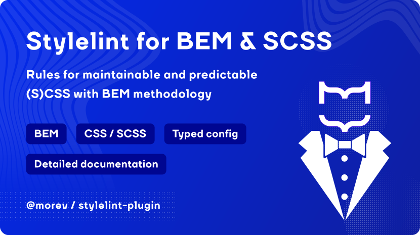

# @morev/stylelint-plugin

A collection of Stylelint rules for writing clean, maintainable (S)CSS with BEM methodology and SCSS best practices.

✔️ Enforces BEM naming conventions and structure for blocks, elements, and modifiers; \
✔️ Includes SCSS-specific rules to prevent unused variables; \
✔️ Promotes clean architecture by blocking side effects and enforcing best practices; \
✔️ Highly configurable to fit your project's style and separators; \
✔️ First-class TypeScript support, written in TS.

For more details on installation, API and more, [go to the documentation website](https://morevm.github.io/stylelint-plugin/).
